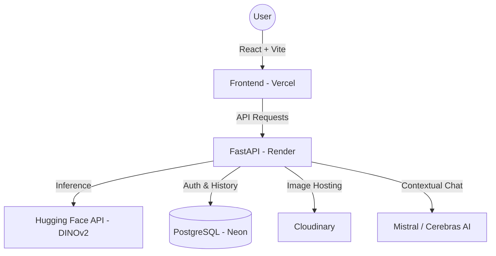

# NeuroDermAI 🩺

[](https://neurodermai-ui.vercel.app/#/dashboard)
[](https://neurodermai-backend.onrender.com/health)

NeuroDermAI is a professional-grade, clinical-screening intelligence platform. It leverages state-of-the-art **DINOv2** vision models to classify 31 different skin conditions with high precision. Designed with a professional clinical aesthetic, the platform provides educational insights, contextual AI assistance, and persistent patient scan history.

---

## 🚀 Live Application
Access the production interface here:  
👉 **[neurodermai-ui.vercel.app](https://neurodermai-ui.vercel.app/#/dashboard)**

---

## ✨ Key Features

- **🔬 Advanced Classification**: Powered by a fine-tuned **DINOv2 (facebook/dinov2-base)** model supporting 31 unique skin conditions.
- **🛡️ Secure Authentication**: Full user registration and login system with JWT-based protection.
- **📊 Persistent History**: Complete scan history stored in a cloud-hosted **PostgreSQL** database (Neon).
- **☁️ Cloud Image Storage**: Patient scans are securely hosted on **Cloudinary**, ensuring data persists across server restarts.
- **💬 AI DermAssistant**: Contextual AI chatbot for educational guidance on screening results.
- **📄 Professional PDF Reports**: Generate and download detailed clinical screening reports for any scan.
- **🎨 Clinical UI**: A flat, professional design system built for medical environments with **Lucide React** iconography.

---

## 🛠️ Technical Architecture



---

## 🗂️ Project Structure

- `frontend/`: React + Vite client using a clinical-grade design system.
- `backend/`: FastAPI service orchestration, authentication, and cloud storage logic.
- `model/`: Documentation and historical notebooks for model development.

---

## ⚙️ Setup & Installation

### Backend
1. **Navigate & Install**:
   ```bash
   cd backend
   python3 -m venv .venv
   source .venv/bin/activate
   pip install -r requirements.txt
   ```
2. **Environment Configuration**: Create a `.env` file based on `.env.example`:
   ```env
   DATABASE_URL=your_postgresql_url
   CLOUDINARY_URL=your_cloudinary_url
   HF_TOKEN=your_huggingface_token
   JWT_SECRET=your_secret
   ```
3. **Run**:
   ```bash
   uvicorn app.main:app --reload
   ```

### Frontend
1. **Navigate & Install**:
   ```bash
   cd frontend
   npm install
   ```
2. **Run**:
   ```bash
   npm run dev
   ```

---

## 📜 Disclaimer

**NeuroDermAI is an educational screening tool and not a medical diagnosis system.**  
The results generated by the AI models are for informational purposes only. Users must always consult a qualified medical professional for any skin concerns, persistent changes, or treatment decisions.

---

## 🤝 Contributing
Contributions are welcome! Please feel free to submit a Pull Request.

---
Developed with ❤️ by the NeuroDermAI Team.
